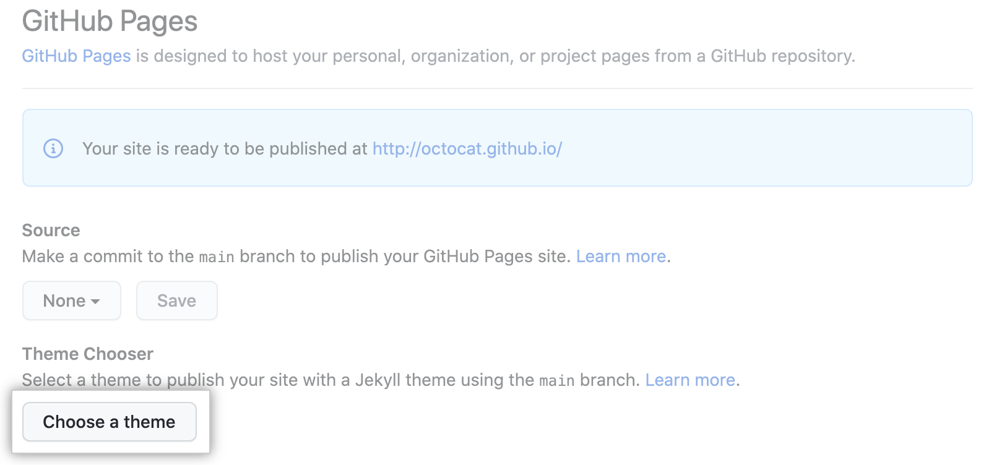
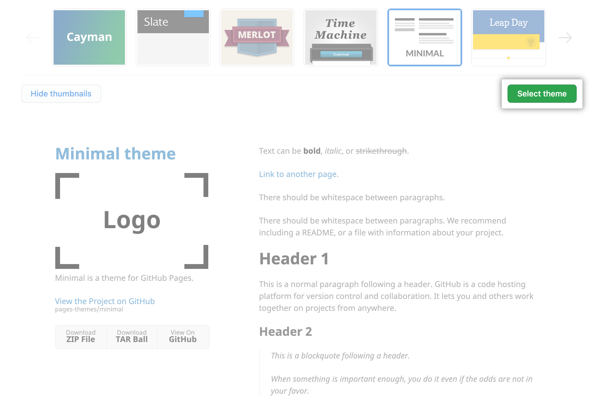

Index / Pages Index / [GitHub Pages](../githubpages) / Quickstart for GitHub Pages
# Quickstart for GitHub Pages

[https://docs.github.com/en/pages/quickstart](https://docs.github.com/en/pages/quickstart)

You can use GitHub Pages to showcase some open source projects, host a blog, or even share your résumé. This guide will help get you started on creating your next website.

GitHub Pages を使ってオープンソースプロジェクトを紹介したり、ブログをホストしたり、あるいはあなたの履歴書を共有したりすることができます。このガイドは、あなたの次のウェブサイトを作成するのに役立つことでしょう。

```
GitHub Pages is available in public repositories with GitHub Free and GitHub Free for organizations, 
and in public and private repositories with GitHub Pro, GitHub Team, GitHub Enterprise Cloud, 
and GitHub Enterprise Server. 
For more information, see "GitHub's products."

GitHub Pagesは、GitHub FreeとGitHub Free for organizationsでパブリックリポジトリ、
GitHub Pro、GitHub Team、GitHub Enterprise Cloud、GitHub Enterprise Serverで
パブリックリポジトリとプライベートリポジトリで利用することができます。
詳しくは、"GitHubの製品 "をご覧ください。
```

## Introduction

GitHub Pages are public webpages hosted and published through GitHub. 
The quickest way to get up and running is by using the Jekyll Theme Chooser to load a pre-made theme. 
You can then modify your GitHub Pages' content and style.

GitHub Pagesは、GitHubを介してホストされ、公開されたパブリックWebページです。
立ち上げて実行する最も迅速な方法は、Jekyllのテーマチューザーを使用して、既製のテーマをロードすることです。
その後、あなたのGitHub Pagesのコンテンツとスタイルを変更することができます。

This guide will lead you through creating a user site at username.github.io.

このガイドでは、username.github.ioにユーザーサイトを作成する方法を説明します。

## Creating your website

1. In the upper-right corner of any page, use the  drop-down menu, and select New repository.

1. 各ページの右上にあるドロップダウンメニューから、「新規リポジトリ」を選択します。


1. Enter username.github.io as the repository name. Replace username with your GitHub username. 
For example, if your username is octocat, the repository name should be octocat.github.io.

1. リポジトリ名として username.github.io を入力します。usernameはGitHubでのユーザー名に置き換えてください。
たとえば、ユーザー名が octocat の場合、リポジトリ名は octocat.github.io となります。


1. Under your repository name, click  Settings.

1. リポジトリ名の下にある「設定」をクリックします。


1. In the "Code and automation" section of the sidebar, click  Pages.

1. サイドバーの「コードとオートメーション」セクションで、「ページ」をクリックします。

1. Click Choose a theme.

1. テーマを選択する」をクリックします。



1. The Theme Chooser will open. Browse the available themes, then click Select theme to select a theme. 
It's easy to change your theme later, so if you're not sure, just choose one for now.

1. テーマチューザーが開きます。利用可能なテーマを参照し、「テーマを選択」をクリックしてテーマを選択します。
テーマは後から簡単に変更できるので、迷ったときはとりあえず選んでおきましょう。

